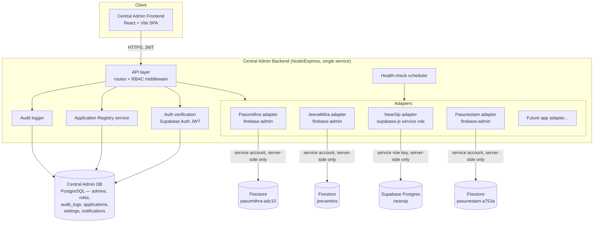

# SLC Central Admin — Architecture

Status: proposed, not yet implemented. See [APPLICATION-INVENTORY.md](./APPLICATION-INVENTORY.md)
for the discovery this is based on, and [INTEGRATION-STRATEGY.md](./INTEGRATION-STRATEGY.md)
for how each app connects.

## Design principles (why the shape below, not something else)

1. **No shared database across apps.** JeevaMitra, Pasumithra, NearSip, and Pasunestam each
   keep their own Firebase/Supabase project untouched. The Central Admin has **its own**
   database for admin-platform concerns only (admin users, roles, audit logs, app registry,
   settings, notifications). Nothing about any app's data model changes because Central Admin
   exists.
2. **Adapters, not a merged backend.** Every app has a different stack (Firebase client-only,
   Firebase+Functions, Supabase, Next.js+Firebase-admin). Rather than forcing one integration
   pattern, the Central Admin backend hosts one **adapter module per app**, each holding that
   app's own credentials and translating a common internal interface into that app's actual
   API/SDK calls. Adding SLC Vet (or any future app) later means writing one new adapter, not
   modifying the platform.
3. **One backend, not microservices.** All adapters live in a single Node/Express service.
   There's no per-app deployment, no message queue, no service mesh — none of that is justified
   by the current scale (a handful of apps, a handful of admins). This can change later if a
   specific bottleneck appears; it should not be assumed up front.
4. **The frontend never talks to an app's backend directly.** Every credential that can write
   to JeevaMitra's Firestore, Pasumithra's Firestore, or NearSip's Supabase project lives only
   in the Central Admin backend's environment/secrets store. The Central Admin frontend only
   ever calls the Central Admin's own API, which is already true of how Pasumithra's
   admin-portal works today (client SDK + rules) — Central Admin intentionally does **not**
   repeat that pattern, because we're introducing credentials with far broader reach (one
   admin login can now touch every app) and want a single, auditable choke point.
5. **Every privileged action is audited**, because none of the existing apps do this today —
   it's a concrete gap the Central Admin is meant to close (see Pasumithra's own
   `KNOWN_LIMITATIONS.md`).

## System diagram



## Components

### Central Admin Frontend
- **React + Vite + TypeScript + Tailwind + React Router.** Deliberately mirrors Pasumithra's
  admin-portal stack — the closest existing precedent in the ecosystem, so nothing new needs
  to be learned by whoever maintains this.
- Talks only to the Central Admin Backend's REST API. Never holds any app's service credentials.
- Pages (see [ROADMAP.md](./ROADMAP.md) for phasing): Login, Dashboard, Application Registry,
  per-app admin views (rendered generically from what each adapter exposes), User Management
  (Central Admin's own admin/staff accounts, not each app's end users), Audit Log, Settings,
  Notifications, Analytics.

### Central Admin Backend
- **Node.js + Express + TypeScript.** One deployable service. Chosen because:
  - The ecosystem is already Node-based (every Cloud Functions codebase is Node), so this
    doesn't introduce a new runtime.
  - It needs to host multiple different vendor SDKs at once (`firebase-admin` for three
    different Firebase projects, `@supabase/supabase-js` with a service-role key) — a plain
    Node service is the simplest place to do that; Cloud Functions tied to one specific
    Firebase project would fight against needing multiple separate projects side by side.
- Structure: `/routes` (REST endpoints, one router per resource), `/middleware` (JWT
  verification, RBAC permission checks, audit-logging middleware), `/adapters/<app-slug>`
  (one folder per integrated app, see below), `/db` (Central Admin's own Postgres access,
  e.g. via Prisma or a lightweight query builder — avoid a heavy ORM if not needed).
- Deployment target: any Node host (Render/Fly.io/a small VM/Cloud Run) — pick whichever the
  user already has infra for. Not Cloudflare Pages/Workers (those don't suit a stateful
  Express app well) and not Vercel serverless functions unless the team specifically wants
  that (cold-start + long-lived DB connections are a worse fit than a normal Node server here).

### Central Admin Database
- **PostgreSQL** (e.g. a dedicated Supabase project used purely as managed Postgres, or any
  managed Postgres — this is a new, independent database, not shared with NearSip's or any
  other app's data).
- Why Postgres and not Firestore, even though 3 of 4 integrated apps use Firestore: the Central
  Admin's own data — admins × roles × permissions × applications × audit logs — is inherently
  relational, and the backend is the *only* thing that ever touches this database directly (the
  frontend never gets a direct DB connection), so Firestore's main selling point for the other
  apps (client-safe access via security rules) doesn't apply here. Relational queries (e.g. "all
  audit log entries by this admin, for this app, in this date range") are what Postgres is
  built for.
- Core tables (see [ROADMAP.md](./ROADMAP.md) Phase 2/3 for when each is built):
  `admin_users`, `roles`, `permissions`, `role_permissions`, `admin_user_apps` (per-app scoping
  of an Admin's access), `applications` (the registry), `health_checks`, `audit_logs`,
  `notifications`, `settings`.

### Authentication (Central Admin's own staff accounts)
- **Supabase Auth** (email/password to start, MFA later) issuing JWTs, verified server-side by
  the Express backend on every request. This is a separate identity system from every
  integrated app's own end-user auth (JeevaMitra's phone/OTP, Pasumithra's phone/OTP +
  email/password, NearSip's email/password) — Central Admin staff accounts are never mixed
  with any app's user table.
- Chosen over rolling a custom auth system because it's proven, low-maintenance, and the team
  already has Supabase account experience (from NearSip) — reusing that familiarity, not
  reusing NearSip's actual project or data.

### RBAC
- Two roles to start, per "don't over-engineer": **Super Admin** (manages other admins, the
  application registry, and global settings; implicit access to everything) and **Admin**
  (access scoped to specific applications via `admin_user_apps`, with per-resource permissions
  from a small fixed permission set — e.g. `users:read`, `users:write`, `listings:moderate`,
  `analytics:read`). Add finer-grained roles later only if a real need appears (e.g. a
  read-only "Auditor" role).
- This directly replaces the inconsistent, ad hoc pattern found in every existing app (no
  claims in JeevaMitra at all, a Firestore-existence check in Pasumithra, a hardcoded password
  in NearSip) with one well-defined system — but only for Central Admin staff. It intentionally
  does not touch how each app authorizes its own end users.

### Application Registry
- A Postgres table (`applications`) holding: name, slug, platform, frontend/backend/database
  tech, auth mechanism, deployment target, status (`active` / `disabled` / `maintenance`),
  which adapter module serves it, and cached health-check state. This is the canonical list
  from [APPLICATION-INVENTORY.md](./APPLICATION-INVENTORY.md), made queryable/editable in the
  Central Admin UI instead of living only in a markdown file.
- "Enable/disable" is **adapter-capability-gated, not universal** — most of these apps have no
  concept of a remote kill-switch today. Concretely: Pasumithra could support "disable" by
  having its adapter write a `config/maintenanceMode` Firestore doc that the *existing*
  `web-app`/`admin-portal` code would need to be taught to check (a small, additive change to
  that app, not something Central Admin can force from outside) — this is called out as a
  Phase 6+ enhancement, not assumed to work day one for every app.

### Integration Adapter Layer
- Common TypeScript interface every adapter implements (a subset is fine — not every app has
  every capability):
  ```ts
  interface AppAdapter {
    getInfo(): AppMeta;                    // static metadata for the registry
    getHealth(): Promise<HealthStatus>;    // "can we reach this app's backend right now"
    listUsers?(params): Promise<User[]>;
    getUser?(id): Promise<User>;
    updateUserStatus?(id, status): Promise<void>;
    listEntities?(type, params): Promise<Entity[]>; // app-specific: listings, bookings, etc.
    getAnalyticsSummary?(): Promise<AnalyticsSummary>;
  }
  ```
- Each adapter privately holds that app's credentials (a Firebase service-account JSON, or a
  Supabase service-role key), injected via environment variables / a secrets manager — **never**
  committed to git, **never** sent to the frontend, **never** logged. This is the concrete
  mechanism satisfying the "never expose service-account credentials/keys" requirement: the only
  place these secrets exist is the Central Admin backend's runtime environment.
- New app integration = new folder under `/adapters`, a new registry row, and new secrets in
  the backend's environment — the API layer, RBAC, audit logging, and frontend all stay
  unchanged.

### API layer / gateway
- The Express app's own router **is** the gateway — a separate API-gateway product (Kong,
  an AWS API Gateway, etc.) would be over-engineering at this scale. Every request flow is:
  `Frontend → Central Admin API (JWT + RBAC checked) → Adapter → App's own backend/DB`.

### Monitoring / health checks
- Each adapter's `getHealth()` does the cheapest meaningful check available for that app (for
  the Firestore-direct apps, this realistically means "can our service account read a known
  document," since none of them expose a pingable server). A scheduler (a simple `setInterval`
  or cron job inside the Express service — no separate monitoring service needed yet) polls
  every adapter periodically and writes to `health_checks`. The dashboard reads that table;
  alerting (Slack/email on failure) is a later addition once there's a real signal worth
  alerting on.

### Audit logging
- Every write that flows through an adapter, and every RBAC/admin-account change, is recorded
  in `audit_logs` (actor, action, target app, target entity, before/after where feasible, IP,
  timestamp) before or immediately after the underlying call. This is new capability, not
  something being migrated from an existing app.

### Notifications & Settings & Analytics
- **Notifications**: start as an in-app notification table + bell icon (e.g. failed health
  checks, new moderation reports aggregated from Pasumithra) — no email/push/Slack integration
  until there's a concrete need.
- **Settings**: a simple key-value `settings` table for Central-Admin-level configuration only
  (not each app's own settings, which stay in that app's own config).
- **Analytics**: start by surfacing what Pasumithra's admin-portal already computes
  (`getAnalyticsSummary()` on its adapter), then extend per-app as other adapters gain the
  capability. Not a general BI/data-warehouse build.

## What this architecture deliberately does not do

- Does not migrate any app's database.
- Does not force Firebase/Supabase/Postgres into one system "for convenience" — three separate
  Firebase projects and one Supabase project keep existing exactly as they are.
- Does not introduce microservices, a message broker, or a service mesh.
- Does not rewrite any existing app's frontend or backend to make it "fit" the platform —
  the one additive change flagged (a maintenance-mode flag Pasumithra could check) is optional,
  small, and deferred to a later phase, not a prerequisite.
- Does not give the Central Admin frontend direct database credentials to any app, ever.
